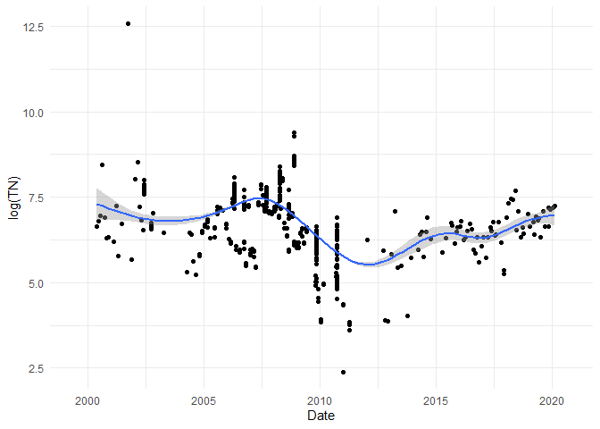

<!-- README.md is generated from README.Rmd. Please edit that file -->

# DukeSWAMP

The goal of DukeSWAMP is to provide long-term water quality data for a
restored Piedmont stream and wetland on Duke University Campus.

## Installation

You can install the development version from
[GitHub](https://github.com/) with:

``` r
# install.packages("devtools")
devtools::install_github("Autumn41/DukeSWAMP")
```

## Example

Here is how you can load and use the data:

``` r
library(DukeSWAMP)
library(tidyverse)

# Visualize log total nitrogen for site WT1
WaterQualityData %>% 
  filter(Site == "WT1") %>% 
  ggplot(aes(x=Date, y=log(TN))) +
  geom_point() + 
  geom_smooth() +
  theme_minimal()
```



Learn more about the dataset by consulting its help file:

``` r
?WaterQualityData
```
